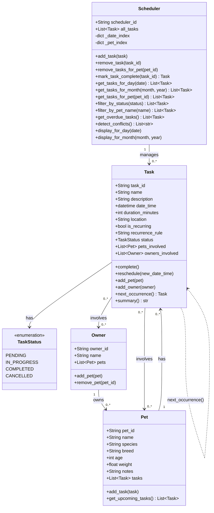

# PawPal+ Project Reflection

## 1. System Design

**a. Initial design**
    So my initial design for the PawPal+ app included the following classes: Owner, Pet, Schedule, and Task. The Owner class is minimal, since the main focus of the app is scheduling events for pets. The pet class has basic information as well such as name and breed. The Task and Schedule classes are where the main logic of the app is. The Task class represents an individual event, such as a walk or feeding time, and includes information such as the time of the event and any special instructions. The Schedule class manages a list of tasks for each pet owner and includes methods for adding, editing, and deleting tasks, as well as viewing the schedule for a specific day or week.

    Some of the main actions that the pawpaw app must be able to do are:
    - Create a new schedule for a pet owner
    - Create a new event for a pet, such as a walk or a feeding time
    - View the schedule for a pet owner, including all events for their pets (Split into two views: one for the current day, and one for the week)
    - Edit or delete existing events in the schedule
    - Add information on the pet, such as their name, breed, and any special needs or preferences
    

- Briefly describe your initial UML design.
- What classes did you include, and what responsibilities did you assign to each?

**b. Design changes**

- Did your design change during implementation?
- If yes, describe at least one change and why you made it.

---

## 2. Scheduling Logic and Tradeoffs

**a. Constraints and priorities**

- What constraints does your scheduler consider (for example: time, priority, preferences)?
- How did you decide which constraints mattered most?

**b. Tradeoffs**

The conflict detection algorithm checks whether two tasks' time windows **overlap** (using `start + duration_minutes`) rather than only flagging exact start-time matches. This means a 60-minute walk starting at 9:00 AM will conflict with a feeding at 9:30 AM for the same pet, which is the correct real-world behavior.

The tradeoff is that the algorithm uses a nested loop (O(n²) in the worst case). For a typical pet owner with tens of tasks per day this is negligible, but it would slow down for very large datasets. A more efficient approach (e.g., a sweep-line algorithm) was not implemented because the simpler nested loop is far easier to read and debug, and the scale of this app does not justify the added complexity. The early `break` in the inner loop (possible because `all_tasks` is kept sorted) partially mitigates this by stopping the inner scan as soon as no further overlap is possible.

---

## 3. AI Collaboration

**a. How you used AI**

AI tools were used across every phase of this project. In Phase 1, I used chat to brainstorm the class design and generate the initial Mermaid UML diagram. In Phase 2, I used it to generate class skeletons with Python dataclasses and to implement method bodies incrementally. In Phase 3, I used `#codebase` prompts to get a full analysis of inefficiencies in the scheduler before implementing indexing improvements. In Phase 4, I used it to draft the full test suite and then to surface all backend features in the Streamlit UI.

The most useful prompt pattern was being specific about constraints: instead of "write a scheduler," asking "implement `get_tasks_for_day` using the existing `_date_index` dict so it doesn't scan all tasks." Scoped prompts produced much cleaner results than open-ended ones.

**b. Judgment and verification**

When the AI initially suggested adding a task list directly to the `Owner` class, I pushed back. The reasoning was that `Owner → Pet → Task` is a clean hierarchy and adding tasks directly to `Owner` would mean maintaining two lists in sync — a known source of bugs. The AI agreed and the design stayed clean. This is an example of the "lead architect" role: the AI can generate code quickly, but decisions about data ownership and consistency have to come from the developer who understands the full system.

---

## 3b. Final UML Diagram

## 4. Testing and Verification

**a. What you tested**

The test suite covers six areas: basic task behavior (complete, reschedule, unique IDs), pet behavior (adding tasks, upcoming task filtering, empty pet edge case), owner behavior (duplicate pet guard, remove pet), scheduler sorting correctness (chronological order after out-of-order inserts, day/month query boundaries), recurrence logic (daily and weekly next-occurrence creation, non-recurring returns None, pets carry over), and conflict detection (overlap detected, exact same time detected, sequential tasks pass, different pets don't conflict, empty scheduler). These tests matter because sorting and conflict detection are the core algorithmic promises of the scheduler — if those break, the UI will silently show wrong data.

**b. Confidence**

★★★★☆ — The core scheduling behaviors are well tested. The main gaps are the Streamlit persistence layer (saving/loading to JSON is not tested), multi-owner scenarios, and timezone handling. These would be the next areas to address.

---

## 5. Reflection

**a. What went well**

The algorithmic layer of the scheduler — sorted insertion with `bisect`, the date and pet indexes, conflict detection using duration-aware overlap, and the automatic recurring task spawning — came together cleanly and all backed by tests. The separation between the backend (`pawpal_system.py`) and the UI (`app.py`) made it straightforward to add new features without breaking existing ones.

**b. What you would improve**

The persistence layer (JSON file) would be the first thing to replace in a next iteration. It does a full rewrite on every change and has no concurrency safety. SQLite via Python's built-in `sqlite3` module would give proper querying, atomic writes, and no full-serialization cost. I'd also add user authentication so multiple owners could use the same deployment.

**c. Key takeaway**

The most important thing I learned is that AI tools are extremely effective at generating code within a well-defined design, but they cannot replace the architect's job of deciding *how the data should be owned and who is responsible for keeping it consistent*. Every time the AI generated something that violated the design (like adding task lists to `Owner`, or using relative imports that broke pytest), catching it required understanding the system as a whole — something only the developer can do. AI accelerates implementation; it does not replace system thinking.
